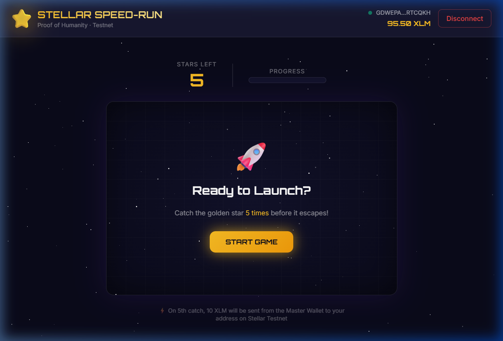
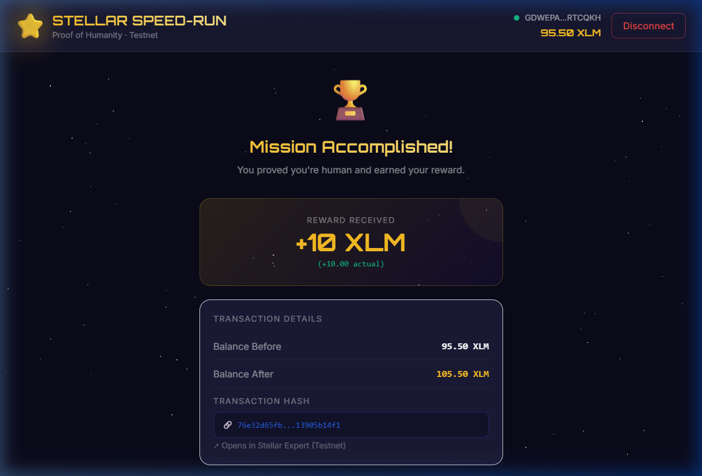

# Stellar Speed-Run 🚀⭐
**Author: Durvesh**

A **proof-of-humanity game** built on the Stellar Testnet. Catch 5 moving golden stars to prove you're human, and receive **10 XLM** instantly on Stellar Testnet.

Built as a **Level 1 White Belt** submission demonstrating core Stellar dApp fundamentals: wallet connection, balance display, and live testnet transactions.

---

## 🎮 How It Works

1. **Connect** your Freighter wallet (Testnet mode)
2. **Click Start** — a golden star appears and moves every 0.8 seconds
3. **Catch the star 5 times** before it escapes
4. **Receive 10 XLM** — a real Stellar testnet transaction is triggered automatically
5. **View your Transaction Hash** linked directly to Stellar Expert explorer

---

## ✅ Features

| Feature | Status |
|---|---|
| Freighter wallet connect / disconnect | ✅ |
| XLM balance fetch (Testnet) | ✅ |
| Live balance update after transaction | ✅ |
| Moving star game (800ms interval) | ✅ |
| 5-click win condition | ✅ |
| Stellar Testnet payment (10 XLM) | ✅ |
| Transaction hash w/ Stellar Expert link | ✅ |
| Before / After balance display | ✅ |
| Dark space theme + gold animations | ✅ |
| Error handling & loading states | ✅ |

---

## 🛠️ Tech Stack

- **React 18** + **Vite** — UI framework
- **Tailwind CSS v3** — Styling
- **stellar-sdk** — Transaction building & Horizon API
- **@stellar/freighter-api** — Freighter wallet integration

---

## 🚀 Setup & Run Locally

### Prerequisites
- [Node.js](https://nodejs.org) v18+
- [Freighter Wallet](https://freighter.app) browser extension (set to **Testnet**)

### 1. Clone & Install

```bash
git clone https://github.com/YOUR_USERNAME/stellar-speed-run.git
cd stellar-speed-run
npm install
```

### 2. Configure Environment

Create a `.env` file in the project root:

```bash
cp .env.example .env
```

Edit `.env` and set your pre-funded Testnet master wallet secret:

```env
VITE_MASTER_SECRET=your_testnet_master_wallet_secret_key_here
```

> 💡 **Need a Testnet wallet?** Use the [Stellar Laboratory](https://laboratory.stellar.org/#account-creator?network=test) or [Friendbot](https://friendbot.stellar.org) to create and fund one.

> ⚠️ **Security**: The `.env` master secret is bundled into the browser for this Testnet MVP. **Never** use a Mainnet key here. For production, move signing to a server-side function.

### 3. Run the App

```bash
npm run dev
```

Open [http://localhost:5173](http://localhost:5173) in your browser.

### 4. Build for Production

```bash
npm run build
```

---

## 📸 Screenshots

### Wallet Connected


### Balance Displayed


### Successful Transaction


---

## 📡 Testnet Details

| Property | Value |
|---|---|
| Network | Stellar Testnet |
| Horizon | `https://horizon-testnet.stellar.org` |
| Explorer | [stellar.expert/testnet](https://stellar.expert/explorer/testnet) |
| Friendbot | `https://friendbot.stellar.org?addr=YOUR_ADDRESS` |

---

## 🏗️ Project Structure

```
stellar-speed-run/
├── src/
│   ├── components/
│   │   ├── Header.jsx       # Wallet connect + balance display
│   │   ├── GameArena.jsx    # The star-catching game (600×400px)
│   │   └── ResultScreen.jsx # TX hash, before/after balance
│   ├── hooks/
│   │   └── useFreighter.js  # Freighter wallet hook
│   ├── utils/
│   │   └── stellar.js       # Balance fetch + XLM payment
│   ├── App.jsx              # Main app + game state machine
│   └── index.css            # Global styles (space theme)
├── .env.example
├── index.html
└── vite.config.js
```

---

## 📝 Level 1 White Belt Requirements

| Requirement | Implementation |
|---|---|
| Freighter wallet setup | `useFreighter.js` hook |
| Wallet connect / disconnect | Header component |
| XLM balance fetch | `getBalance()` in `stellar.js` |
| Balance display | Header badge + Result screen |
| Send XLM transaction | `sendXLM()` in `stellar.js` |
| Transaction feedback | ResultScreen (hash + explorer link) |
| Error handling | Wallet errors, TX errors, no-wallet state |

---

## ⚖️ License

MIT — free to use, fork, and learn from.

---

## 👥 Authors

- **Durvesh** — [@Durvesh452](https://github.com/Durvesh452)
